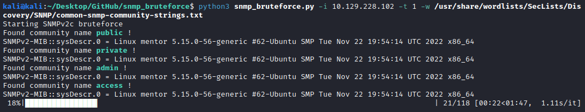

# snmp_bruteforce

SNMP bruteforce script with customizable settings. Supports SNMPv1 and SNMPv2c.
Built in python3

## Usage

```bash
snmp_bruteforce.py [-h] --wordlist WORDLIST --ip IP [--snmp-version SNMP_VERSION] [--port PORT] [--timeout TIMEOUT]

SNMP community bruteforce by kashmir54

options:
  -h, --help            show this help message and exit

  --wordlist WORDLIST, -w WORDLIST
                        Wordlist with usual community names
  --ip IP, -i IP        Target IP

  --snmp-version SNMP_VERSION, -v SNMP_VERSION
                        SNMP Version to use (1, [2c])

  --port PORT, -p PORT  Target port [161]

  --timeout TIMEOUT, -t TIMEOUT
                        Timeout for the SNMP calls [2]
```

Recommended wordlist: [Seclists SNMP](https://github.com/danielmiessler/SecLists/blob/master/Discovery/SNMP/common-snmp-community-strings.txt)


## Examples

```bash
# SNMPv2c at 10.129.228.102 port 161 with 1 second timeout 
python3 snmp_bruteforce.py -i 10.129.228.102 -t 1 -w /usr/share/wordlists/SecLists/Discovery/SNMP/common-snmp-community-strings.txt


# SNMPv1 at 10.129.228.102 port 1616 with 3 seconds timeout 
python3 snmp_bruteforce.py -i 10.129.228.102 -p 1616 -v 1 -t 3 -w /usr/share/wordlists/SecLists/Discovery/SNMP/common-snmp-community-strings.txt

```

## Output

